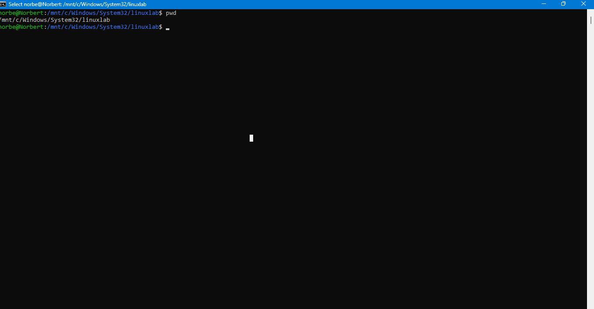
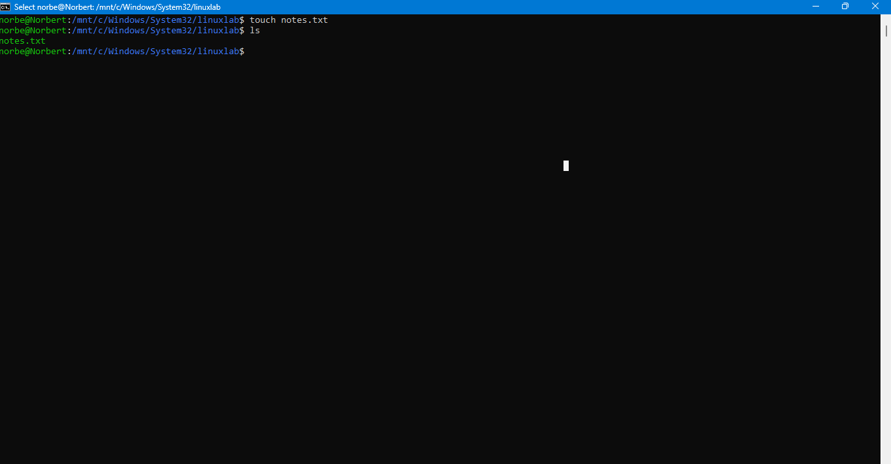

\# Basic Linux Commands


This lab contains beginner Linux administration and troubleshooting commands commonly used in IT support, cloud, and system administration environments.


\## Commands Practiced


\### Navigation Commands


```bash

pwd

ls

cd

mkdir

## Screenshots

### Linux Navigation Commands



### Linux File Management



